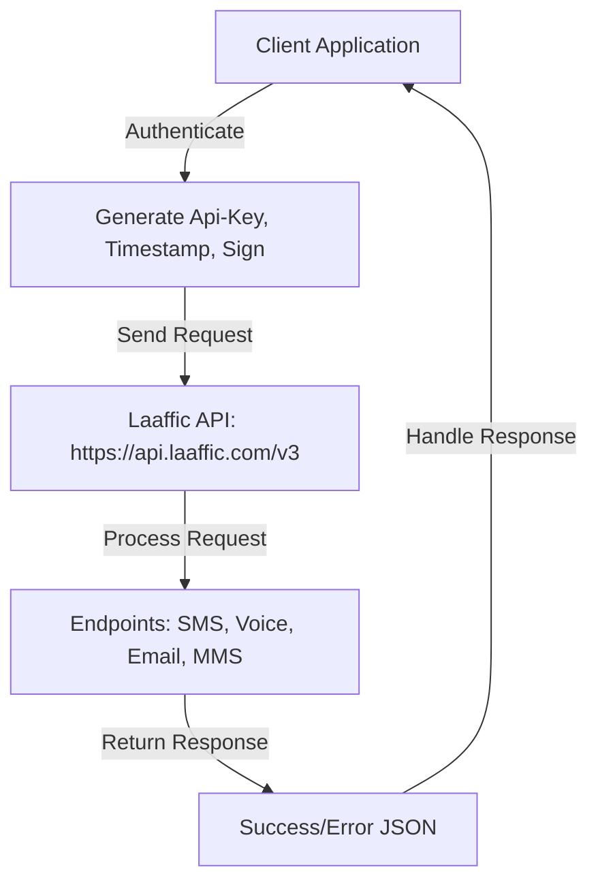
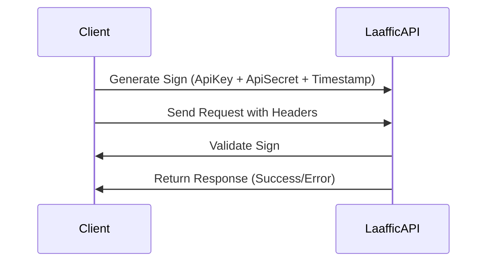
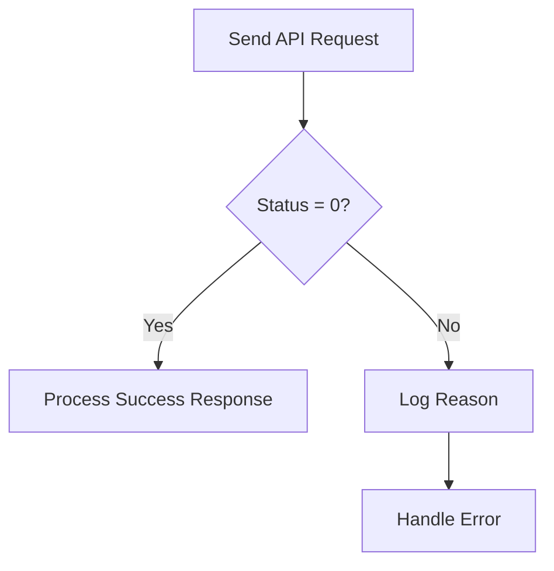
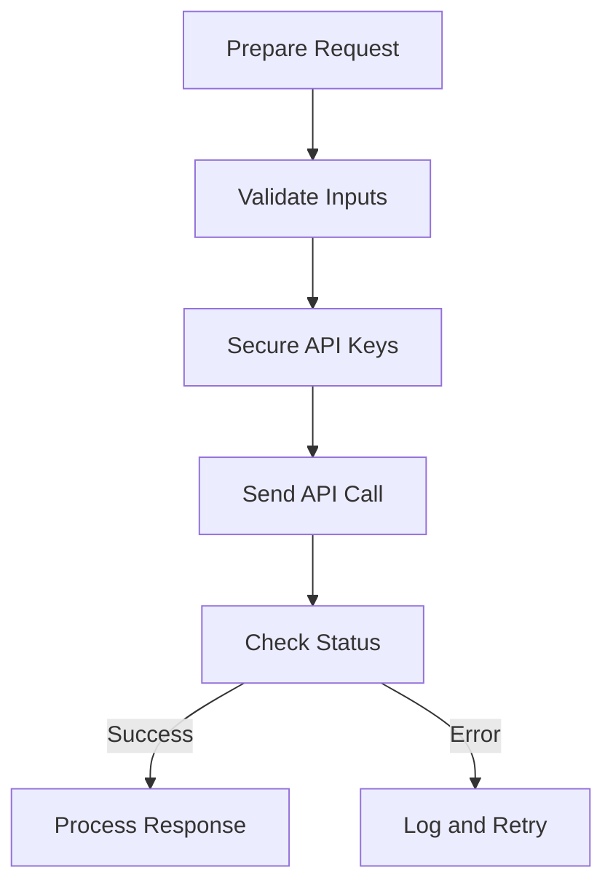

# Laaffic API Documentation


The **Laaffic API** provides a robust suite of communication tools for SMS, Voice, Email, and MMS, tailored for businesses in gaming, sports betting, and other industries. This documentation serves as a comprehensive guide for AI agents and developers to integrate the API into web applications, covering all endpoints, authentication, and usage examples.

> **Purpose**: Enable AI agents to understand and utilize the Laaffic API for building scalable communication solutions.

## Table of Contents

- [Overview](#overview)
- [Authentication](#authentication)
- [API Endpoints](#api-endpoints)
  - [SMS APIs](#sms-apis)
    - [Send SMS](#send-sms)
    - [Get SMS Report](#get-sms-report)
    - [Get SMS Report by Time Slot](#get-sms-report-by-time-slot)
    - [Get SMS Report Pushed by Platform](#get-sms-report-pushed-by-platform)
  - [Voice APIs](#voice-apis)
    - [Invoke Phone (Send SIP)](#invoke-phone-send-sip)
    - [Inquire Phone (SIP Query)](#inquire-phone-sip-query)
    - [Send TTS Voice Message](#send-tts-voice-message)
    - [Voice Group Call Task Creation](#voice-group-call-task-creation)
    - [Upload Audio File](#upload-audio-file)
  - [Email APIs](#email-apis)
    - [Batch Send Email](#batch-send-email)
  - [MMS APIs](#mms-apis)
    - [Upload MMS Attachments](#upload-mms-attachments)
  - [Number Management APIs](#number-management-apis)
    - [Querying the AXB Relationship List](#querying-the-axb-relationship-list)
    - [Number Pool Configuration](#number-pool-configuration)
- [Error Handling](#error-handling)
- [Examples](#examples)
- [Best Practices](#best-practices)
- [Contact and Support](#contact-and-support)

---

## Overview

The Laaffic API offers a one-stop solution for global communication, supporting SMS, Voice, Email, and MMS across 220+ countries. It provides features like Marketing SMS, Verification SMS, Voice OTP, and Email campaigns, with RESTful endpoints and SDK support.

**Base URL**: `https://api.laaffic.com/v3`

### Key Features
- **Global Reach**: Supports 220+ countries with high delivery rates.
- **Multi-Channel**: SMS, Voice, Email, and MMS for marketing and authentication.
- **Security**: HTTPS/SSL encryption for all API calls.
- **Scalability**: Handles bulk operations (e.g., 1000 SMS per POST request).
- **Reporting**: Detailed delivery and status reports for campaigns.

### API Workflow



---

## Authentication

All API requests require authentication headers for security.

**Headers**:
| Header        | Description |
|---------------|-------------|
| `Content-Type`| `application/json;charset=UTF-8` |
| `Api-Key`     | Unique API key from Laaffic Developer Options |
| `Timestamp`   | Current timestamp in seconds (e.g., `1630468800`) |
| `Sign`        | MD5 hash of `ApiKey + ApiSecret + Timestamp` |

### Generating the Sign Header

1. Concatenate `ApiKey`, `ApiSecret`, and `Timestamp`.
2. Compute the MD5 hash.

**Example in Python**:
```python
import hashlib
import time

api_key = "your_api_key"
api_secret = "your_api_secret"
timestamp = str(int(time.time()))
sign = hashlib.md5(f"{api_key}{api_secret}{timestamp}".encode('utf-8')).hexdigest()
```

**Example Headers**:
```http
Content-Type: application/json;charset=UTF-8
Api-Key: bDqJFiq9
Timestamp: 1630468800
Sign: 05d7a50893e22a5c4bb3216ae3396c7c
```

### Authentication Flow



---

## API Endpoints

### SMS APIs

#### Send SMS

Send single or bulk SMS messages.

- **Endpoint**: `/sendSms`
- **Method**: GET or POST
- **Description**: Sends SMS to up to 100 numbers (GET) or 1000 numbers (POST).

**Parameters**:
| Parameter  | Type   | Required | Description |
|------------|--------|----------|-------------|
| `appId`    | String | Yes      | Application ID |
| `numbers`  | String | Yes      | Comma-separated phone numbers |
| `content`  | String | Yes      | Message content |
| `senderId` | String | Yes      | Sender ID (max 32 chars) |
| `orderId`  | String | Yes      | Comma-separated order IDs |

**GET Request**:
```http
GET /v3/sendSms?appId=4luaKsL2&numbers=91856321412,91856321413&content=hello%20world&senderId=123&orderId=21412,21413
Host: api.laaffic.com
Content-Type: application/json;charset=UTF-8
Api-Key: bDqJFiq9
Timestamp: 1630468800
Sign: 05d7a50893e22a5c4bb3216ae3396c7c
```

**POST Request**:
```http
POST /v3/sendSms HTTP/1.1
Host: api.laaffic.com
Content-Type: application/json;charset=UTF-8
Api-Key: bDqJFiq9
Timestamp: 1630468800
Sign: 05d7a50893e22a5c4bb3216ae3396c7c

{
  "appId": "4luaKsL2",
  "numbers": "91856321412,91856321413",
  "content": "hello world",
  "senderId": "123",
  "orderId": "21412,21413"
}
```

**Response**:
```json
{
  "status": "0",
  "reason": "success",
  "msgIds": ["2108021054011000095", "2108021059531000096"]
}
```

#### Get SMS Report

Retrieve delivery status for SMS messages.

- **Endpoint**: `/getReport`
- **Method**: GET
- **Description**: Queries status for up to 200 message IDs.

**Parameters**:
| Parameter | Type   | Required | Description |
|-----------|--------|----------|-------------|
| `appId`   | String | Yes      | Application ID |
| `msgIds`  | String | Yes      | Comma-separated message IDs |

**Request**:
```http
GET /v3/getReport?appId=4luaKsL2&msgIds=2108021054011000095,2108021059531000096
Host: api.laaffic.com
Content-Type: application/json;charset=UTF-8
Api-Key: bDqJFiq9
Timestamp: 1630468800
Sign: 05d7a50893e22a5c4bb3216ae3396c7c
```

**Response**:
```json
{
  "status": "0",
  "reason": "success",
  "success": "2",
  "fail": "0",
  "sending": "0",
  "nofound": "0",
  "array": [
    {
      "msgId": "2108021054011000095",
      "number": "91856321412",
      "receiveTime": "2021-02-12T09:30:03+08:00",
      "status": "0"
    },
    {
      "msgId": "2108021059531000096",
      "number": "91856321413",
      "receiveTime": "2021-02-12T09:30:03+08:00",
      "status": "0"
    }
  ]
}
```

#### Get SMS Report by Time Slot

Retrieve SMS delivery reports for a time period.

- **Endpoint**: `/getSentRcd`
- **Method**: GET
- **Description**: Queries records within 90 days, max 31-day interval, up to 50,000 results.

**Parameters**:
| Parameter    | Type   | Required | Description |
|--------------|--------|----------|-------------|
| `appId`      | String | Yes      | Application ID |
| `startTime`  | String | Yes      | Start time (e.g., `2021-02-12T00:00:00+08:00`) |
| `endTime`    | String | Yes      | End time (e.g., `2021-02-12T23:59:59+08:00`) |
| `startIndex` | String | Yes      | Pagination start index |

**Request**:
```http
GET /v3/getSentRcd?appId=4luaKsL2&startTime=2021-02-12T00:00:00+08:00&endTime=2021-02-12T23:59:59+08:00&startIndex=0
Host: api.laaffic.com
Content-Type: application/json;charset=UTF-8
Api-Key: bDqJFiq9
Timestamp: 1630468800
Sign: 05d7a50893e22a5c4bb3216ae3396c7c
```

**Response**:
```json
{
  "status": "0",
  "reason": "success",
  "data": {
    "total": 2,
    "records": [
      {
        "msgId": "2108021054011000095",
        "number": "91856321412",
        "receiveTime": "2021-02-12T09:30:03+08:00",
        "status": "0"
      },
      {
        "msgId": "2108021059531000096",
        "number": "91856321413",
        "receiveTime": "2021-02-12T09:30:03+08:00",
        "status": "0"
      }
    ]
  }
}
```

#### Get SMS Report Pushed by Platform

Receive SMS delivery reports via callback.

- **Endpoint**: User-defined URL
- **Method**: POST
- **Description**: Laaffic pushes reports to a user-specified URL.

**Request Body**:
| Parameter     | Type   | Description |
|---------------|--------|-------------|
| `appId`       | String | Application ID |
| `msgid`       | String | Message ID |
| `mobile`      | String | Recipient number |
| `status`      | Int    | Delivery status |
| `reason`      | String | Status reason |
| `timestamp`   | Long   | Report timestamp |
| `orderId`     | String | Order ID |
| `pricedetail` | Object | Pricing details |

**Request**:
```http
POST /user/callback HTTP/1.1
Host: user-defined-host
Content-Type: application/json;charset=UTF-8

{
  "appId": "4luaKsL2",
  "msgid": "2108021059531000096",
  "mobile": "91850000000",
  "status": 0,
  "reason": "0",
  "timestamp": 1629801177192,
  "orderId": "gdkalskgn",
  "pricedetail": {
    "pay": "0.02",
    "currency": "EUR",
    "chargeCnt": 2,
    "price": "0.01"
  }
}
```

**Response**: User-defined confirmation.

### Voice APIs

#### Invoke Phone (Send SIP)

Initiate a voice call using SIP.

- **Endpoint**: `/voice/sendSip`
- **Method**: POST
- **Description**: Starts a voice call to a specified number.

**Request Body**:
| Parameter    | Type   | Required | Description |
|--------------|--------|----------|-------------|
| `appId`      | String | Yes      | Application ID |
| `callee`     | String | Yes      | Called number (7-15 digits) |
| `displayNum` | String | No       | Display number (7-15 digits or null) |
| `account`    | String | Yes      | Voice application account |

**Request**:
```http
POST /v3/voice/sendSip HTTP/1.1
Host: api.laaffic.com
Content-Type: application/json;charset=UTF-8
Api-Key: bDqJFiq9
Timestamp: 1630468800
Sign: 05d7a50893e22a5c4bb3216ae3396c7c

{
  "callee": "932111111111",
  "displayNum": "1008122211",
  "account": "test_001",
  "appId": "4luaKsL2"
}
```

**Response**:
```json
{
  "status": "0",
  "reason": "success"
}
```

#### Inquire Phone (SIP Query)

Query voice call records.

- **Endpoint**: `/voice/sipQuery`
- **Method**: POST
- **Description**: Retrieves paginated voice call records.

**Request Body**:
| Parameter | Type    | Required | Description |
|-----------|---------|----------|-------------|
| `appId`   | String  | Yes      | Application ID |
| `current` | Integer | Yes      | Current page number |
| `size`    | Integer | Yes      | Records per page |

**Request**:
```http
POST /v3/voice/sipQuery HTTP/1.1
Host: api.laaffic.com
Content-Type: application/json;charset=UTF-8
Api-Key: bDqJFiq9
Timestamp: 1630468800
Sign: 05d7a50893e22a5c4bb3216ae3396c7c

{
  "current": 1,
  "size": 20,
  "params": {
    "appId": "4luaKsL2"
  }
}
```

**Response**:
```json
{
  "status": "0",
  "reason": "success",
  "data": {
    "total": 10,
    "size": 20,
    "current": 1,
    "records": []
  }
}
```

#### Send TTS Voice Message

Send a Text-to-Speech (TTS) voice message.

- **Endpoint**: `/voice/sendCode`
- **Method**: POST
- **Description**: Sends a customizable TTS voice message.

**Request Body**:
| Parameter        | Type    | Required | Description |
|------------------|---------|----------|-------------|
| `appId`          | String  | Yes      | Application ID |
| `callee`         | String  | Yes      | Called number (7-15 digits) |
| `displayNum`     | String  | No       | Display number |
| `language`       | String  | Yes      | Language code (e.g., `EN`) |
| `accent`         | String  | Yes      | Accent code (e.g., `91`) |
| `ssmlGender`     | Integer | No       | Voice gender (1=male, 2=female) |
| `speakingRate`   | Double  | Yes      | Speaking speed |
| `text`           | String  | Yes      | Message text |
| `loopCount`      | Integer | No       | Loops (1-9, default: 1) |
| `recallCount`    | Integer | No       | Recall attempts (0-9, default: 0) |
| `recallInterval` | Integer | No       | Recall interval (minutes) |
| `maxDuration`    | Integer | No       | Max call duration (seconds) |
| `maxRingingTime` | Integer | No       | Max ringing time (seconds) |
| `calledInfo`     | String  | No       | Additional call info |
| `delayPlay`      | Integer | No       | Delay before playing |
| `delayHangup`    | Integer | No       | Delay before hanging up |

**Request**:
```http
POST /v3/voice/sendCode HTTP/1.1
Host: api.laaffic.com
Content-Type: application/json;charset=UTF-8
Api-Key: bDqJFiq9
Timestamp: 1630468800
Sign: 05d7a50893e22a5c4bb3216ae3396c7c

{
  "callee": "932111111111",
  "displayNum": "1008122211",
  "language": "EN",
  "accent": "91",
  "ssmlGender": 2,
  "speakingRate": 1,
  "text": "hello world",
  "appId": "4luaKsL2",
  "loopCount": 2,
  "recallCount": 0,
  "recallInterval": 0,
  "maxDuration": 120,
  "maxRingingTime": 60,
  "calledInfo": "calledInfo",
  "delayPlay": 0,
  "delayHangup": 0
}
```

**Response**:
```json
{
  "status": "0",
  "reason": "success"
}
```

#### Voice Group Call Task Creation

Create a group call task.

- **Endpoint**: `/voice/group/call/send`
- **Method**: POST
- **Description**: Initiates a group voice call with SMS and routing options.

**Request Body**:
| Parameter         | Type    | Required | Description |
|-------------------|---------|----------|-------------|
| `appId`           | String  | Yes      | Application ID |
| `taskName`        | String  | Yes      | Task name |
| `source`          | Integer | Yes      | Source type |
| `loopCount`       | Integer | Yes      | Loops (1-9) |
| `maxCalls`        | Integer | Yes      | Max concurrent calls |
| `hangUpSms`       | Integer | Yes      | Post-call SMS (1=yes, 0=no) |
| `toSeat`          | Integer | Yes      | Route to agent (1=yes, 0=no) |
| `sipGroupId`      | Integer | Yes      | SIP group ID |
| `outboundControl` | Integer | Yes      | Outbound control flag |
| `calloutRate`     | Integer | Yes      | Callout rate |
| `toSeatKey`       | Integer | Yes      | Seat key |
| `toSeatType`      | Integer | Yes      | Seat type |
| `numberList`      | Array   | Yes      | Phone numbers |
| `sendTime`        | String  | Yes      | Scheduled send time |
| `text`            | String  | Yes      | Voice message text |
| `smsAppId`        | String  | Yes      | SMS application ID |
| `senderId`        | String  | Yes      | Sender ID for SMS |
| `smsContent`      | String  | Yes      | Post-call SMS content |
| `feedbackValue`   | Integer | Yes      | Feedback value |
| `successPushTime` | Integer | Yes      | Success push time |
| `feedbackPush`    | Integer | Yes      | Feedback push flag |
| `successPush`     | Integer | Yes      | Success push flag |
| `failedPush`      | Integer | Yes      | Failed push flag |
| `ringPush`        | Integer | Yes      | Ring push flag |
| `lan`             | String  | Yes      | Language code |
| `displayNum`      | String  | Yes      | Display number |
| `maxRingingTime`  | Integer | Yes      | Max ringing time |
| `allowSendTime`   | Array   | Yes      | Allowed send time slots |

**Request**:
```http
POST /v3/voice/group/call/send HTTP/1.1
Host: api.laaffic.com
Content-Type: application/json;charset=UTF-8
Api-Key: bDqJFiq9
Timestamp: 1630468800
Sign: 05d7a50893e22a5c4bb3216ae3396c7c

{
  "appId": "iaAJ6COV",
  "taskName": "2024-06-03 10:42:0511",
  "source": 3,
  "loopCount": 1,
  "maxCalls": 40,
  "hangUpSms": 1,
  "toSeat": 1,
  "sipGroupId": 1000019,
  "outboundControl": 1,
  "calloutRate": 1,
  "toSeatKey": 0,
  "toSeatType": 2,
  "numberList": ["8613242926514"],
  "sendTime": "2024-06-21 00:00:00",
  "text": "Mã xác nhận của bạn là 22294",
  "smsAppId": "9obbP7Nl",
  "senderId": "123",
  "smsContent": "123",
  "feedbackValue": 0,
  "successPushTime": 10,
  "feedbackPush": 0,
  "successPush": 0,
  "failedPush": 0,
  "ringPush": 1,
  "lan": "VN",
  "displayNum": "1008122211",
  "maxRingingTime": 60,
  "allowSendTime": [
    {
      "strTime": "18:28",
      "endTime": "19:28"
    }
  ]
}
```

**Response**:
```json
{
  "status": "0",
  "reason": "success"
}
```

#### Upload Audio File

Upload an audio file for voice campaigns.

- **Endpoint**: `/voice/fileUpload`
- **Method**: POST
- **Description**: Uploads Base64-encoded audio files.

**Request Body**:
| Parameter  | Type   | Required | Description |
|------------|--------|----------|-------------|
| `fileName` | String | Yes      | File name (e.g., `test.mp3`) |
| `file`     | String | Yes      | Base64-encoded file content |

**Request**:
```http
POST /v3/voice/fileUpload HTTP/1.1
Host: api.laaffic.com
Content-Type: application/json;charset=UTF-8
Api-Key: bDqJFiq9
Timestamp: 1630468800
Sign: 05d7a50893e22a5c4bb3216ae3396c7c

{
  "fileName": "test.mp3",
  "file": "Base64 encoded file content"
}
```

**Response**:
```json
{
  "status": "0",
  "reason": "success"
}
```

### Email APIs

#### Batch Send Email

Send bulk emails with templates.

- **Endpoint**: `/email/batchSendEmail`
- **Method**: GET or POST
- **Description**: Sends emails to a recipient list with callback support.

**Parameters**:
| Parameter          | Type   | Required | Description |
|--------------------|--------|----------|-------------|
| `appId`            | String | Yes      | Application ID |
| `fromEmailAddress` | String | Yes      | Sender email address |
| `receiverId`       | String | Yes      | Recipient list ID |
| `subject`          | String | Yes      | Email subject |
| `templateID`       | String | Yes      | Template ID |
| `url`              | String | Yes      | Callback URL |
| `adFlag`           | Integer| No       | Add advertising logo |
| `language`         | String | No       | Language code |
| `triggerID`        | Integer| No       | Automation trigger ID |

**GET Request**:
```http
GET /v3/email/batchSendEmail?appId=fKFtblIy&fromEmailAddress=test@mailpush.laaffic.cn&receiverId=1000&subject=helloWorld&templateID=1&url=https://IP:port/task/email/notice
Host: api.laaffic.com
Content-Type: application/json;charset=UTF-8
Api-Key: bDqJFiq9
Timestamp: 1630468800
Sign: 05d7a50893e22a5c4bb3216ae3396c7c
```

**POST Request**:
```http
POST /v3/email/batchSendEmail HTTP/1.1
Host: api.laaffic.com
Content-Type: application/json;charset=UTF-8
Api-Key: bDqJFiq9
Timestamp: 1630468800
Sign: 05d7a50893e22a5c4bb3216ae3396c7c

{
  "appId": "fKFtblIy",
  "fromEmailAddress": "test@mailpush.laaffic.cn",
  "receiverId": "1000",
  "subject": "hello world",
  "templateID": "1",
  "url": "https://IP:port/task/email/notice"
}
```

**Response**:
```json
{
  "status": "0",
  "reason": "success"
}
```

### MMS APIs

#### Upload MMS Attachments

Upload MMS attachments.

- **Endpoint**: `/mmsUpload`
- **Method**: POST
- **Description**: Uploads Base64-encoded MMS attachments.

**Request Body**:
| Parameter   | Type   | Required | Description |
|-------------|--------|----------|-------------|
| `fileType`  | String | Yes      | File type (e.g., `txt`, `png`) |
| `fileData`  | String | Yes      | Base64-encoded file content |

**Request**:
```http
POST /v3/mmsUpload HTTP/1.1
Host: api.laaffic.com
Content-Type: application/json;charset=UTF-8
Api-Key: bDqJFiq9
Timestamp: 1630468800
Sign: 05d7a50893e22a5c4bb3216ae3396c7c

{
  "fileType": "png",
  "fileData": "Base64 encoded file content"
}
```

**Response**:
```json
{
  "status": "0",
  "reason": "success"
}
```

### Number Management APIs

#### Querying the AXB Relationship List

Query AXB number bindings.

- **Endpoint**: `/number/pns/queryBindPage`
- **Method**: POST
- **Description**: Retrieves paginated AXB number bindings.

**Request Body**:
| Parameter | Type    | Required | Description |
|-----------|---------|----------|-------------|
| `current` | Integer | Yes      | Current page number |
| `size`    | Integer | Yes      | Records per page |
| `params`  | Object  | Yes      | Contains `appId` |

**Request**:
```http
POST /v3/number/pns/queryBindPage HTTP/1.1
Host: api.laaffic.com
Content-Type: application/json;charset=UTF-8
Api-Key: bDqJFiq9
Timestamp: 1630468800
Sign: 05d7a50893e22a5c4bb3216ae3396c7c

{
  "current": 1,
  "size": 10,
  "params": {
    "appId": "4luaKsL2"
  }
}
```

**Response**:
```json
{
  "status": "0",
  "reason": "success",
  "data": {
    "total": 5,
    "size": 20,
    "current": 1,
    "pages": 1,
    "records": [
      {
        "bindId": 1234,
        "phoneA": "915027021995",
        "phoneB": "9150270219956",
        "pnsNumberA": "91502211",
        "pnsNumberB": "915022112",
        "expireTime": "2023-10-22 09:00:00"
      }
    ]
  }
}
```

#### Number Pool Configuration

Configure a number pool.

- **Endpoint**: `/number/editNumberPool`
- **Method**: POST
- **Description**: Sets up a number pool with whitelists.

**Request Body**:
| Parameter          | Type   | Required | Description |
|--------------------|--------|----------|-------------|
| `poolNumber`       | String | Yes      | Pool number |
| `customerWhitelist`| String | Yes      | IP whitelist |
| `maxConcurrency`   | Integer| Yes      | Max concurrent calls |
| `numberList`       | Array  | Yes      | Phone numbers |

**Request**:
```http
POST /v3/number/editNumberPool HTTP/1.1
Host: api.laaffic.com
Content-Type: application/json;charset=UTF-8
Api-Key: bDqJFiq9
Timestamp: 1630468800
Sign: 05d7a50893e22a5c4bb3216ae3396c7c

{
  "poolNumber": "918885",
  "customerWhitelist": "192.168.10.17,192.168.10.18",
  "maxConcurrency": 99,
  "numberList": ["9178605501", "9178605502"]
}
```

**Response**:
```json
{
  "status": "0",
  "reason": "success"
}
```

---

## Error Handling

Responses include `status` and `reason` fields:

- **Success**:
  ```json
  {
    "status": "0",
    "reason": "success"
  }
  ```

- **Error**:
  ```json
  {
    "status": "1",
    "reason": "Invalid appId"
  }
  ```

**Common Status Codes**:
- `0`: Success
- Non-zero: Error (check `reason`)

**Error Handling Flow**:


---

## Examples

### Example 1: Sending SMS in Python

```python
import hashlib
import time
import requests
import json

base_url = "https://api.laaffic.com/v3"
api_key = "your_api_key"
api_pwd = "your_api_secret"
app_id = "4luaKsL2"
numbers = "91856321412,91856321413"
content = "hello world"
sender_id = "123"
order_id = "21412,21413"

def create_headers():
    timestamp = int(time.time())
    sign = hashlib.md5(f"{api_key}{api_pwd}{timestamp}".encode('utf-8')).hexdigest()
    return {
        'Content-Type': 'application/json;charset=utf-8',
        'Sign': sign,
        'Timestamp': str(timestamp),
        'Api-Key': api_key
    }

headers = create_headers()
url = f"{base_url}/sendSms"
body = {
    "appId": app_id,
    "numbers": numbers,
    "content": content,
    "senderId": sender_id,
    "orderId": order_id
}

response = requests.post(url, json=body, headers=headers)
if response.status_code == 200:
    print(json.loads(response.text))
else:
    print(f"Error: {response.status_code}")
```

### Example 2: Sending TTS Voice Message in PHP

```php
<?php
header('content-type:text/html;charset=utf8');
$apiKey = "your_api_key";
$apiSecret = "your_api_secret";
$appId = "4luaKsL2";
$callee = "932111111111";
$displayNum = "1008122211";
$language = "EN";
$accent = "91";
$ssmlGender = 2;
$speakingRate = 1;
$text = "hello world";

$timeStamp = time();
$sign = md5($apiKey . $apiSecret . $timeStamp);

$dataArr = [
    'callee' => $callee,
    'displayNum' => $displayNum,
    'language' => $language,
    'accent' => $accent,
    'ssmlGender' => $ssmlGender,
    'speakingRate' => $speakingRate,
    'text' => $text,
    'appId' => $appId,
    'loopCount' => 2,
    'recallCount' => 0,
    'recallInterval' => 0,
    'maxDuration' => 120,
    'maxRingingTime' => 60,
    'calledInfo' => "calledInfo",
    'delayPlay' => 0,
    'delayHangup' => 0
];

$data = json_encode($dataArr);
$headers = [
    'Content-Type:application/json;charset=UTF-8',
    "Sign:$sign",
    "Timestamp:$timeStamp",
    "Api-Key:$apiKey"
];

$ch = curl_init();
curl_setopt($ch, CURLOPT_URL, "https://api.laaffic.com/v3/voice/sendCode");
curl_setopt($ch, CURLOPT_POST, 1);
curl_setopt($ch, CURLOPT_HTTPHEADER, $headers);
curl_setopt($ch, CURLOPT_POSTFIELDS, $data);
curl_setopt($ch, CURLOPT_RETURNTRANSFER, 1);
curl_setopt($ch, CURLOPT_SSL_VERIFYPEER, 0);
curl_setopt($ch, CURLOPT_SSL_VERIFYHOST, 0);

$output = curl_exec($ch);
curl_close($ch);
var_dump($output);
?>
```

---

## Best Practices

1. **Secure API Keys**: Store `ApiKey` and `ApiSecret` in environment variables.
2. **Rate Limiting**: Respect limits (e.g., 100 numbers for GET `/sendSms`).
3. **Error Handling**: Check `status` and log `reason` for debugging.
4. **Pagination**: Use `current` and `size` for large datasets.
5. **Callback URLs**: Ensure URLs are secure and accessible.
6. **Validation**: Validate inputs (e.g., phone numbers) before API calls.
7. **Monitoring**: Use `/getReport` and `/getSentRcd` to track performance.

### Best Practices Flow



---

## Contact and Support

- **Email**: [marketing@laaffic.com](mailto:marketing@laaffic.com)
- **Live Chat**: Available on [Laaffic Website](https://www.laaffic.com)
- **Social Media**:
  - Twitter: [Laaffic Twitter](https://twitter.com/laaffic)
  - LinkedIn: [Laaffic LinkedIn](https://linkedin.com/company/laaffic)
  - YouTube: [Laaffic YouTube](https://www.youtube.com/@Laaffic)

---

This documentation is designed for AI agents and developers, with clear examples and visuals to facilitate integration of the Laaffic API into web applications. For updates, visit [Laaffic API Center](https://www.laaffic.com/api/).
